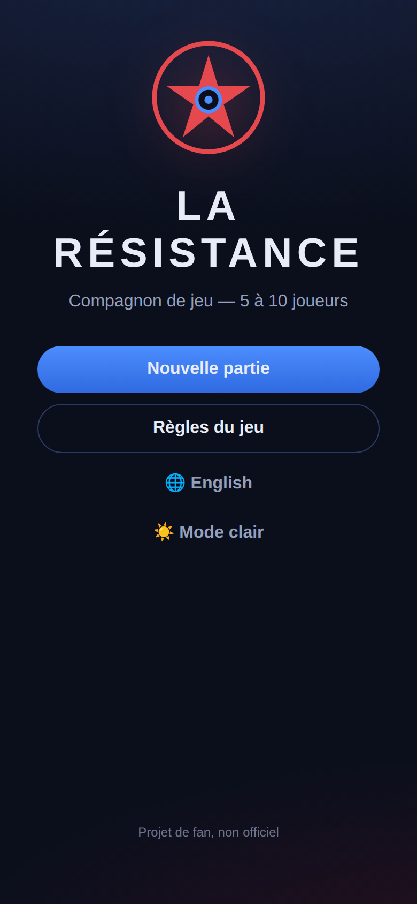
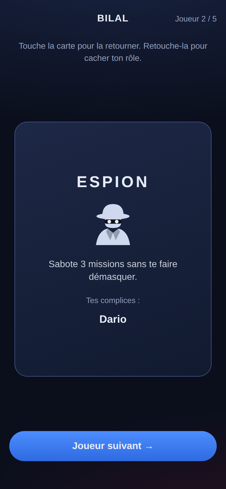
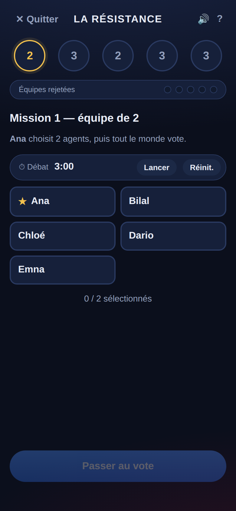
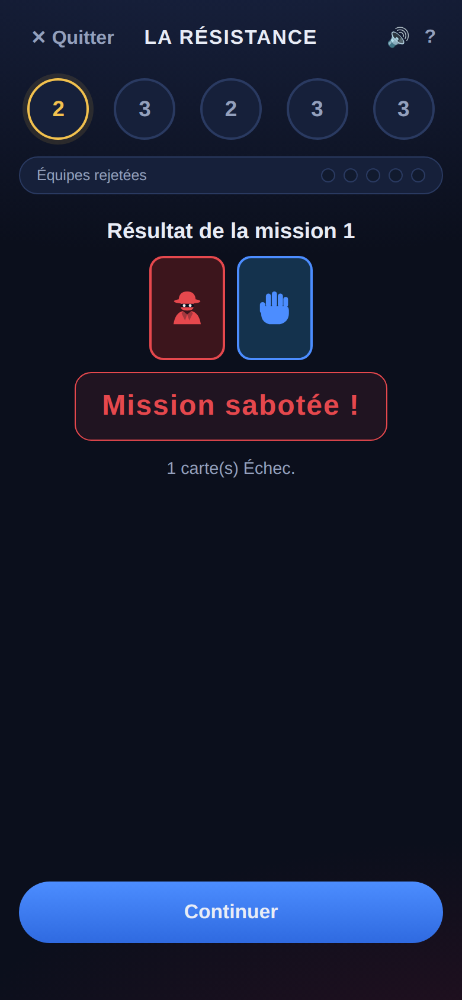

# La Résistance — Compagnon de jeu 🕵️

Application compagnon **non officielle** pour jouer au jeu de déduction sociale
*The Resistance* entre amis, avec **un seul téléphone** qui passe de main en main.
5 à 10 joueurs : la majorité appartient à la Résistance, mais des espions
infiltrés cherchent à saboter les missions…

C'est une **PWA** (application web) : elle s'installe sur l'écran d'accueil
d'un téléphone et fonctionne **entièrement hors ligne**. Aucun serveur, aucun
compte, aucune donnée collectée.

## ✨ Fonctionnalités

- **Distribution secrète des rôles** : chacun retourne sa carte d'un simple
  toucher (animation 3D) et la re-cache avant de passer le téléphone. Les
  espions découvrent leurs complices.
- **Mode Commandant (optionnel)** : le Commandant connaît les espions ; si la
  Résistance réussit 3 missions, l'Assassin des espions peut l'éliminer au
  dernier moment pour voler la victoire.
- **Suivi complet de la partie** : 5 missions, tailles d'équipe officielles,
  rotation du chef d'équipe, piste des votes rejetés (5 rejets = victoire des
  espions), règle des « 2 échecs » pour la mission 4 à partir de 7 joueurs.
- **Vote public** pour approuver ou rejeter chaque équipe.
- **Missions secrètes** : chaque agent choisit Succès ou Échec sur le
  téléphone, puis on retourne les cartes mélangées — impossible de savoir qui
  a saboté.
- **Anti-regards indiscrets** : pendant une mission, l'écran est strictement
  identique pour tous les rôles (mêmes fonds de cartes, rien de désactivé —
  seules les étiquettes sont colorées : Échec en rouge, Succès en bleu),
  l'ordre des deux cartes est tiré au sort pour chaque joueur (la position du
  doigt ne révèle rien), et un résistant qui touche Échec sélectionne
  automatiquement Succès (règle officielle). Les cartes de rôle utilisent
  aussi un fond neutre illisible à distance.
- **Thème clair ou sombre** ☀️🌙 : bouton sur l'écran d'accueil, préférence
  mémorisée.
- **Annonceur vocal** 🔊 : l'app annonce à voix haute à qui passer le
  téléphone, les résultats des votes et des missions, et le vainqueur
  (synthèse vocale du téléphone, FR/EN, bouton muet en cours de partie).
- **Cérémonie d'ouverture guidée** : posez le téléphone au centre, la voix
  mène le rituel — « Fermez tous les yeux… Espions, reconnaissez vos
  complices… » — avec tic-tac pendant les pauses, adaptée aux options
  (espions à l'aveugle, mode Commandant).
- **Options** : variante « espions à l'aveugle », mode Commandant, annonceur
  vocal, minuteur de discussion (3 / 5 / 10 min).
- **Bilingue** : français 🇫🇷 (par défaut) et anglais 🇬🇧.
- **Reprise de partie** : la partie en cours est sauvegardée sur le téléphone.

## 📸 Aperçu

| Accueil | Rôle secret | Plateau | Mission |
|---|---|---|---|
|  |  |  |  |

## 🚀 Jouer

### En ligne (GitHub Pages)

**👉 https://dadi00xm-maker.github.io/Spy/**

À chaque push sur `main`, GitHub Actions relance les tests puis publie le
site sur la branche `gh-pages`, servie par GitHub Pages.

> Si le site ne répond pas, vérifier dans **Settings → Pages** que la source
> est **Deploy from a branch** avec la branche **gh-pages** (dossier `/`).

Sur téléphone, ouvrir le lien puis « **Ajouter à l'écran d'accueil** » :
l'app s'installe et fonctionne ensuite sans connexion.

### En local

```bash
python3 -m http.server 8000
# puis ouvrir http://localhost:8000
```

(ou simplement double-cliquer sur `index.html`)

## 🎲 Rappel des règles

| Joueurs | Espions | Équipes (missions 1→5) |
|:-------:|:-------:|:----------------------:|
| 5       | 2       | 2 · 3 · 2 · 3 · 3      |
| 6       | 2       | 2 · 3 · 4 · 3 · 4      |
| 7       | 3       | 2 · 3 · 3 · 4 · 4      |
| 8       | 3       | 3 · 4 · 4 · 5 · 5      |
| 9       | 3       | 3 · 4 · 4 · 5 · 5      |
| 10      | 4       | 3 · 4 · 4 · 5 · 5      |

Chaque manche : le chef propose une équipe → tout le monde vote → si l'équipe
est approuvée, ses membres jouent Succès/Échec en secret. Une carte Échec
suffit à saboter (deux pour la mission 4 à partir de 7 joueurs). Première
faction à 3 missions gagnées l'emporte ; 5 équipes rejetées d'affilée donnent
la victoire aux espions.

## 🛠️ Technique

- HTML / CSS / JavaScript pur, **aucune dépendance**, aucun build.
- `js/rules.js` : logique de jeu pure (testée), `js/app.js` : machine à états
  et interface, `js/i18n.js` : textes FR/EN.
- Service worker (`sw.js`) : cache hors ligne. `manifest.webmanifest` : installation PWA.

### Tests

```bash
node tests/test-rules.js
```

## 📁 Structure

```
index.html            Point d'entrée
css/style.css         Thème sombre mobile
js/rules.js           Règles (pur, testable)
js/i18n.js            Textes FR / EN
js/app.js             États + interface
sw.js                 Hors ligne (service worker)
manifest.webmanifest  Installation PWA
icons/                Icônes de l'app
tests/                Tests de la logique
.github/workflows/    Déploiement GitHub Pages
```

## ⚖️ Mentions

Projet de fan, développé pour un usage privé entre amis. Non affilié aux
auteurs ou éditeurs du jeu de société *The Resistance* ni à aucune application
existante. Tout le code, les textes et les visuels de ce dépôt sont originaux
(licence MIT).
